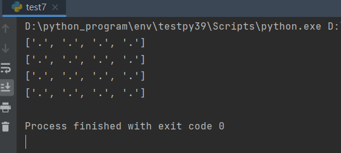

# Queens Puzzle

**八皇后問題**是一個以西洋棋為背景的問題：如何能夠在8×8的西洋棋棋盤上放置八個[皇后](https://zh.wikipedia.org/wiki/%E5%90%8E_(%E5%9B%BD%E9%99%85%E8%B1%A1%E6%A3%8B))，使得任何一個皇后都無法直接吃掉其他的皇后。而規則如下:

- 不能同行，同列
- 不能有左右斜對角

滿足以上條件皇后無法吃掉其他皇后

例子

目前我們有個4X4的棋盤

```
.  .  .  .  
.  .  .  .  
.  .  .  .  
.  .  .  .  
```

假設放皇后在(0,0)，那麼同行與同列還有左右斜對角都不能放置皇后，因此如下X地方為不可放置位置

```
Q  X  X  X  
X  X  .  .  
X  .  X  .  
X  .  .  X  
```

因此得知規則後，來呈現完整符合規則的棋盤，以4X4的例子會有兩個解法

解法1

```
.  Q  .  .  
.  .  .  Q  
Q  .  .  .  
.  .  Q  .  
```

解法2

```
.  .  Q  .  
Q  .  .  .  
.  .  .  Q  
.  Q  .  .  
```

解了規則與解法後接下來透過python來實現，首先先建立棋盤

```python
class QueensPuzzle:

    def __init__(self, rows, cols):
        self.rows = rows
        self.cols = cols
        self.checkerboard = [['.' for _ in range(cols)] for _ in range(rows)]

    def print_board(self):
        print("\n".join(str(row) for row in self.checkerboard))

queens_puzzle = QueensPuzzle(8, 8)

queens_puzzle.print_board()

```

列印後這就為4X4棋盤



接下來就是實作，在實作之前要先完全了解一下流程，假設第一步放置(0,0)，且是列掃描由上至下

```
Q  .  .  .  
.  .  .  .  
.  .  .  .  
.  .  .  .  
```

我們先省略如何判斷是否符合規則，假設算法都能正常運作，當第一步驟放置(1,2)

```
Q  .  .  .  
.  .  Q  .  
.  .  .  .  
.  .  .  .  
```

接著第二步驟就會發現無法放置皇后，因為規則都不符合

```
Q  .  .  .  
.  .  Q  .  
.  .  .  .  
.  .  .  .  
```

當這種情況發生時，我們需要將第二步驟回溯回去接著嘗試不同位置(1,2)變(1,3)

```
Q  .  .  .  
.  .  .  Q  
.  .  .  .  
.  .  .  .  
```

了解上面流程後我們可以得知實作要處理的部分有以下:

- 需實作棋盤掃描
- 因為皇后可能後面步驟不滿足規則，需要重新擺放旗子
- 判斷是否同列，同行，左右斜對角

因此可以先掃描，並擺放皇后，當擺放皇后時可以篩選掉哪些是不可擺放的位置，所以第一層擺放(0,0)時，可以確定第二層就不能擺放(1,0)與(1,1)，可以先記錄就能避免多餘的判斷

```
Q  X  X  X  第一層
X  X  .  .  第二層
X  .  X  .  第三層
X  .  .  X  第四層
```

接著就是判斷是否同行，同列，左右斜對角，同行與同列很簡單就是紀錄行與列的Index

舉例

以上面例子看Q在(0,0)時，後面座標(0, y), (x, 0)就不會有皇后

```
Q  X  X  X  第一層
X  X  .  .  第二層
X  .  X  .  第三層
X  .  .  X  第四層
```

接著對角線部分有公式來計算是否為對角線

### **左對角線值計算方式**

$$
\text{row} - \text{col}
$$

### **右對角線值計算方式**

$$
row + col
$$

了解如何判斷後就能計算出不能擺放皇后座標，我們再以例子來佐證我們想法是正確的

例子

第一層皇后擺在(0,1)，因此第0row不會有皇后，第1col不會有皇后，然後對角部分由公式推算

```
                 index
X  Q  X  X  第一層 0 
X  X  X  .  第二層 1
.  X  .  X  第三層 2
.  X  .  .  第四層 3
```

左對角值

0 -1 = -1

右對角值

0 +1 = 1

因此當第二層時，row = 1

1 - x = -1, x = 2

1 + x = 1, x = 0

結果，(1,2)與(1,0)是不能擺放的，因為是他的左右對角

```
                 index
X  Q  X  X  第一層 0 
X  X  X  .  第二層 1
.  X  .  X  第三層 2
.  X  .  .  第四層 3
```

第三層與第四層以此類推

第三層

2 - x = -1, x = 3

2 + x = 1, x = -1(棋盤沒有-1，所以省略)

```
                  index
X  Q  X  X  第一層 0 
X  X  X  .  第二層 1
.  X  .  X  第三層 2
.  X  .  .  第四層 3
```

第四層

3 - x = -1, x = 4(4超過棋盤範圍，所以省略)

3 + x = 1, x = -4(棋盤沒有-4，所以省略)

```
                  index
X  Q  X  X  第一層 0 
X  X  X  .  第二層 1
.  X  .  X  第三層 2
.  X  .  .  第四層 3
```

程式實作部分定義三個set存放篩選Index

- occupied_columns: 記錄col(行)
- occupied_left_diagonals: 紀錄左斜線值
- occupied_right_diagonals: 紀錄右斜線值

<aside>
💡

row 由左至右， col 由上而下

</aside>

```python
def is_valid(self, row, col, occupied_columns, occupied_left_diagonals, occupied_right_diagonals):
    if col in occupied_columns or (row - col) in occupied_left_diagonals or (row + col) in occupied_right_diagonals:
        return False
    return True

def handle(self):
    def backtrack(row, occupied_columns, occupied_left_diagonals, occupied_right_diagonals):
        for col in range(self.cols):
            if self.is_valid(row, col, occupied_columns, occupied_left_diagonals, occupied_right_diagonals):
                self.checkerboard[col][row] = 'Q'
                self.print_board()
                occupied_columns.add(col)
                occupied_left_diagonals.add(row - col)
                occupied_right_diagonals.add(row + col)

    backtrack(0, set(), set(), set())
```

執行後結果


這邊就會發現一個問題，迴圈是由左往右，但row 永遠不變因為我們從外面傳入0

```python
backtrack(0, set(), set(), set())
```

所以這邊需要實作遞迴，每當擺放皇后時，row就要+1直到等於邊界為止

```python
backtrack(row +1,
          occupied_columns=occupied_columns,
          occupied_left_diagonals=occupied_left_diagonals,
          occupied_right_diagonals=occupied_right_diagonals)
```

執行後結果


疑當跑到第三個棋盤時，怎麼會有皇后在旁邊? 這邊就要談到遞迴以及我們處理方式，這是因為

當遞迴第三層時，因為皇后無法下在第三層任何地方

```
Q  X  X  X  第一層  
X  X  Q  X  第二層 
X  X  X  X  第三層 
X  .  X  .  第四層 
```

因此程式回到掃秒遞二層，而第二層上次處理到(1,2)，而剛好前面所提到的我們只記錄了下面這三者

- occupied_columns: 記錄col(行)
- occupied_left_diagonals: 紀錄左斜線值
- occupied_right_diagonals: 紀錄右斜線值

照理應該要紀錄row(列)才對，但因為程式算法是當我們滿足條件就往下一層掃秒，因此不需要紀錄，但現在剛好碰到遞三層都不擺放皇后，因此回到第二層，而在驗證時，剛好(1,3)滿足了條件，因此就被擺上皇后了

```
Q  X  X  X  
X  X  Q  X  第二層因為沒必要紀錄row，我們只記錄col，但剛好(0,0)與(1,2)的紀錄沒有篩選掉(1,3)
X  X  X  X  
X  .  X  .  
```

因此當整層都不符合擺放皇后條件時，我們需要回溯上一個皇后，在回溯時需要將上一層的皇后給移除掉，以及col(行)與左右斜線都移除

```python
self.checkerboard[row][col] = '.'
occupied_columns.remove(col)
occupied_left_diagonals.remove(row - col)
occupied_right_diagonals.remove(row + col)
```

結果，無法截圖所已將結果打印上來

```python
['Q', '.', '.', '.']
['.', '.', '.', '.']
['.', '.', '.', '.']
['.', '.', '.', '.']
--------------------
['Q', '.', '.', '.']
['.', '.', 'Q', '.']
['.', '.', '.', '.']
['.', '.', '.', '.']
--------------------
['Q', '.', '.', '.']
['.', '.', '.', 'Q'] # 掃描第三層找不到結果，因此回溯並第二層繼續for loop就會將皇后擺放(1,3)
['.', '.', '.', '.']
['.', '.', '.', '.']
--------------------
['Q', '.', '.', '.']
['.', '.', '.', 'Q']
['.', 'Q', '.', '.']
['.', '.', '.', '.']
--------------------
['.', 'Q', '.', '.']
['.', '.', '.', '.']
['.', '.', '.', '.']
['.', '.', '.', '.']
--------------------
['.', 'Q', '.', '.']
['.', '.', '.', 'Q']
['.', '.', '.', '.']
['.', '.', '.', '.']
--------------------
['.', 'Q', '.', '.']
['.', '.', '.', 'Q']
['Q', '.', '.', '.']
['.', '.', '.', '.']
--------------------
['.', 'Q', '.', '.']
['.', '.', '.', 'Q']
['Q', '.', '.', '.']
['.', '.', 'Q', '.'] # 最終找尋到解答
-------------------- # 接著繼續遞迴全部結束為止
['.', '.', 'Q', '.']
['.', '.', '.', '.']
['.', '.', '.', '.']
['.', '.', '.', '.']
--------------------
['.', '.', 'Q', '.']
['Q', '.', '.', '.']
['.', '.', '.', '.']
['.', '.', '.', '.']
--------------------
['.', '.', 'Q', '.']
['Q', '.', '.', '.']
['.', '.', '.', 'Q']
['.', '.', '.', '.']
--------------------
['.', '.', 'Q', '.']
['Q', '.', '.', '.']
['.', '.', '.', 'Q']
['.', 'Q', '.', '.']
--------------------
['.', '.', '.', 'Q']
['.', '.', '.', '.']
['.', '.', '.', '.']
['.', '.', '.', '.']
--------------------
['.', '.', '.', 'Q']
['Q', '.', '.', '.']
['.', '.', '.', '.']
['.', '.', '.', '.']
--------------------
['.', '.', '.', 'Q']
['Q', '.', '.', '.']
['.', '.', 'Q', '.']
['.', '.', '.', '.']
--------------------
['.', '.', '.', 'Q']
['.', 'Q', '.', '.']
['.', '.', '.', '.']
['.', '.', '.', '.']
-------------------- # 結束
最終有兩個解答
['.', 'Q', '.', '.']
['.', '.', '.', 'Q']
['Q', '.', '.', '.']
['.', '.', 'Q', '.']
--------------------
['.', '.', 'Q', '.']
['Q', '.', '.', '.']
['.', '.', '.', 'Q']
['.', 'Q', '.', '.']

```

最後我們定義一個list來存放這些解答，以及判斷當目前col達到棋盤定義範圍就代表已經有解答了，因為有最佳解才會一直row+1直到與棋盤邊界相等

```python
class QueensPuzzle:

    def __init__(self, rows, cols):
        self.rows = rows
        self.cols = cols
        self.checkerboard = [['.' for _ in range(cols)] for _ in range(rows)]
        self.solutions = [] # 定義list
    
    ...
    def handle(self):
        def backtrack(row, occupied_columns, occupied_left_diagonals, occupied_right_diagonals):
            if row == self.rows: # 判斷是否找尋到解答
                self.solutions.append(["".join(r) for r in self.checkerboard])
                return
                
	  #實作解答打印方法
	  def print_solve(self):
        print(f"共{len(self.solutions)}個解答")
        for solution in self.solutions:
            for row in solution:
                print(row)
            print()
```

完整程式碼

```python
class QueensPuzzle:

    def __init__(self, rows, cols):
        self.rows = rows
        self.cols = cols
        self.checkerboard = [['.' for _ in range(cols)] for _ in range(rows)]
        self.solutions = []

    def is_valid(self, row, col, occupied_columns, occupied_left_diagonals, occupied_right_diagonals):
        if col in occupied_columns or (row - col) in occupied_left_diagonals or (row + col) in occupied_right_diagonals:
            return False
        return True

    def print_solve(self):
        print(f"共{len(self.solutions)}個解答")
        for solution in self.solutions:
            for row in solution:
                print(row)
            print()

    def handle(self):
        def backtrack(row, occupied_columns, occupied_left_diagonals, occupied_right_diagonals):
            if row == self.rows:
                self.solutions.append(["".join(r) for r in self.checkerboard])
                return

            for col in range(self.cols):
                if self.is_valid(row, col, occupied_columns, occupied_left_diagonals, occupied_right_diagonals):
                    self.checkerboard[row][col] = 'Q'
                    occupied_columns.add(col)
                    occupied_left_diagonals.add(row - col)
                    occupied_right_diagonals.add(row + col)
                    backtrack(row + 1,
                              occupied_columns=occupied_columns,
                              occupied_left_diagonals=occupied_left_diagonals,
                              occupied_right_diagonals=occupied_right_diagonals)
                    self.checkerboard[row][col] = '.'
                    occupied_columns.remove(col)
                    occupied_left_diagonals.remove(row - col)
                    occupied_right_diagonals.remove(row + col)

        backtrack(0, set(), set(), set())

    def print_board(self):
        print("\n".join(str(row) for row in self.checkerboard))

queens_puzzle = QueensPuzzle(4, 4)

queens_puzzle.handle()
queens_puzzle.print_solve()

```
